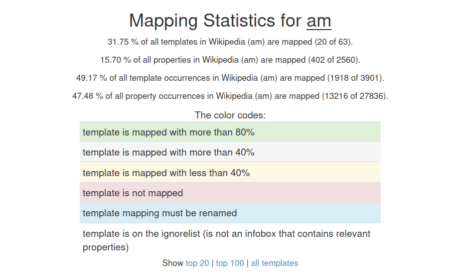
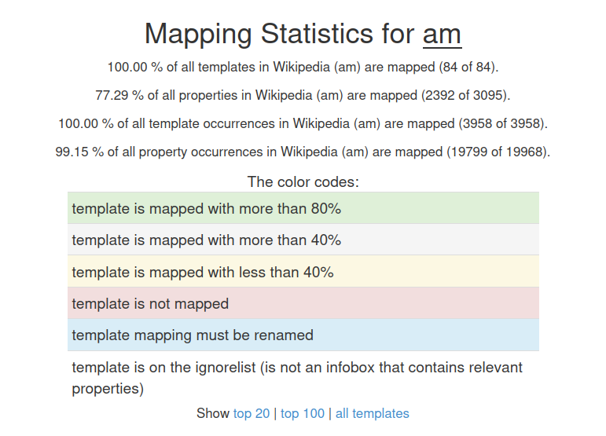

# GSoC-25: DBpedia Amharic Chapter  

## Project Summary  
Amharic Wikipedia lacks structured knowledge representation, which limits its integration into global knowledge graphs like DBpedia. This gap hinders the accessibility, discoverability, and interoperability of Amharic content in multilingual semantic web applications.  

This project proposes to enhance the **Amharic chapter of DBpedia** by extracting structured data from Amharic Wikipedia. It involves extending the DBpedia Extraction Framework to support Amharic, creating new mappings for infobox templates, and extracting rich semantic data such as citations, disambiguations, and anchor texts.  

The output will be published as **RDF triples** and made accessible via a user-friendly web interface, following **FAIR (Findable, Accessible, Interoperable, Reusable)** data principles.  

## Key Achievements and Deliverables  

  ### 1. Wikipedia Templates and Pages 

  During the project, several Wikipedia templates and pages were created or updated to support structured knowledge representation in Amharic Wikipedia. These efforts form the foundation for DBpedia mappings.

  #### Summary of Work Completed

  | Category              | Count | Remark                                                                 |
  |-----------------------|-------|------------------------------------------------------------------------|
  | New Template Created  | 23    | Total: 23 templates. Expected to update the existing templates in the future. |
  | Updated Templates     | 0     |                                                                        |
  | New Pages Created     | 11    | Total: 24 pages                                                        |
  | Updated Pages         | 13    |                                                                        |

  The complete list of created and updated templates is provided in [Appendix A](https://github.com/AmharicDBpedia/AmharicDBpedia/blob/GSOC2025/documentation/GSoC%202025%20Documentation%20v1.0.pdf), while the list of created and updated Wikipedia pages is included in [Appendix B](https://github.com/AmharicDBpedia/AmharicDBpedia/blob/GSOC2025/documentation/GSoC%202025%20Documentation%20v1.0.pdf). These appendices include both the names and direct links to each resource for easy verification and further exploration.

  ### 2. Mapping Coverage Progress  [View Amharic Mapping](https://mappings.dbpedia.org/index.php/Mapping_am)

  The mapping activity for Amharic DBpedia has shown significant progress compared to the previous status.

  #### Coverage Summary

  - **Previous Coverage**: 17 mapped templates  
  - **Current Coverage**: 97 mapped templates

  #### Breakdown of the 97 Mapped Templates

  - **65 Templates** are in **Amharic** and actively aligned with pages in Amharic Wikipedia.
  - **24 Templates** are in **English**. These were added primarily to ensure **backward compatibility** with existing Wikipedia pages that rely on English-based infoboxes.  
    - While this maintains the link between DBpedia mappings and the pages, these templates will require **future translation into Amharic** both in Wikipedia and in DBpedia mappings.
  - **8 Templates** are **redirects** to other templates. These are included in the total but do not represent unique templates.
  - A small number of mapped templates **do not yet have related Wikipedia pages**, which explains their exclusion from current mapping statistics.  
    - These templates are retained to support **potential future use**.

  #### Key Improvements

  - Expanded from **17 → 97** mapped templates — representing **more than a 5× increase** in coverage.
  - Significant growth in **Amharic-native template support**, strengthening local knowledge representation.
  - Maintained **compatibility with English templates** to preserve continuity, with **translation work identified** as a next step.

  A detailed breakdown of the created and updated template mappings, including direct links to each, is provided in [Appendix C](https://github.com/AmharicDBpedia/AmharicDBpedia/blob/GSOC2025/documentation/GSoC%202025%20Documentation%20v1.0.pdf).

  ### 3. Mapping Statistics Generation

  Mapping statistics are essential for evaluating the quality and completeness of DBpedia mappings. They provide insights into how many templates and properties are mapped, how frequently they appear in Wikipedia pages, and where inconsistencies or gaps exist. By generating these statistics locally, we can continuously monitor progress, identify problematic mappings, and validate the effectiveness of recent updates to the Amharic DBpedia project.

  #### Old Statistics Report (Amharic)

  Before generating new statistics, the server was run to analyze the existing Amharic DBpedia mappings.

    
  *Figure: Screenshot of old mapping statistics*

  ##### Summary of Mapping Coverage

  | Metric                      | Count | Total | Percentage |
  |-----------------------------|-------|-------|------------|
  | Mapped Templates            | 20    | 63    | 31.75%     |
  | Mapped Template Occurrences | 1918  | 3901  | 49.17%     |
  | Mapped Properties           | 402   | 2560  | 15.70%     |
  | Mapped Property Occurrences | 13216 | 27836 | 47.48%     |

  Analysis has been done on old statistics report and identified template limitations, mapping issues, proposed solutions, and executed them successfully.

  #### Technical Challenges and Fixes

  ##### Problem Encountered

  While generating statistics, the template count consistently returned zero. Templates were being detected, but their associated properties were not. As a result, all templates were ignored in the statistics output. After debugging, I identified that the issue was caused by reliance on `infobox_test.ttl`. This file did not properly support the current dumps.

  ##### Fix Implemented

  The solution was to switch from `infobox_test.ttl` to `infobox_properties.ttl`, which contains the required property mappings. This required modifications in the following classes:

  - [CreateMappingStats.scala](https://github.com/contact-andy/extraction-framework/blob/main/server/src/main/scala/org/dbpedia/extraction/server/stats/CreateMappingStats.scala)
  - [MappingStatsBuilder.scala](https://github.com/contact-andy/extraction-framework/blob/main/server/src/main/scala/org/dbpedia/extraction/server/stats/MappingStatsBuilder.scala)

  After implementing the above changes:
  - Mapping statistics successfully generated.
  - Templates and properties were correctly counted.

  Results confirmed that `infobox_properties.ttl` is more reliable for current dumps.

  In addition, **Amharic ignore list** (templates and properties excluded from statistics) has been managed. [View change log](https://github.com/contact-andy/extraction-framework/blob/GSoc-2025-Amharic-Mapping/server/src/main/statistics/ignorelist_am.txt)

  #### Current Amharic Mapping Statistics Report [View change log](https://github.com/contact-andy/extraction-framework/blob/GSoc-2025-Amharic-Mapping/server/src/main/statistics/mappingstats_am.txt)

  After applying fixes (ontology corrections, new mappings, and the ignore list), the updated statistics report shows the following:

    
  *Figure: Screenshot of current mapping statistics*

  ##### Summary of Mapping Coverage

  | Metric                      | Count | Total | Percentage | Notes                                  |
  |-----------------------------|-------|-------|------------|----------------------------------------|
  | Mapped Templates            | 84    | 84    | 100%       | Achieved full coverage (previously 31.75%) |
  | Mapped Template Occurrences | 3958  | 3958  | 100%       | All templates aligned and fully mapped |
  | Mapped Properties           | 2392  | 3095  | 77.29%     | Significant increase from 15.70%       |
  | Mapped Property Occurrences | 19799 | 19968 | 99.15%     | Major improvement due to property fixes and normalization |

  The improvements demonstrate both breadth and depth: all templates are now covered, template occurrences are fully aligned, and property coverage has improved substantially. However, further effort is still needed to achieve full coverage of properties, especially for rarely used or inconsistent ones.

 
  ### 4. Documentation

  Provided a comprehensive guide for creating, mapping, and extracting structured data from **Amharic Wikipedia** using the **DBpedia Extraction Framework**.

  #### Covered Workflow

  The documentation covers the end-to-end workflow:

  - Creating and updating Wikipedia templates  
  - Defining mappings  
  - Running extractions  
  - Generating statistics  
  - Querying the resulting knowledge graph  

  #### Additional Information

  - Includes challenges, solutions, and recommendations to improve coverage and quality.  
  - Designed to help contributors, mentors, and researchers **reproduce**, **extend**, and **contribute** effectively to the **Amharic DBpedia** chapter.

  **Read the documentation here:** [GSoC 2025 Documentation](https://github.com/AmharicDBpedia/AmharicDBpedia/blob/GSOC2025/documentation/GSoC%202025%20Documentation%20v1.0.pdf)
  

  ### 5. Website Development 

  Based on the recommendations of my mentors, I have updated the existing website for the **Amharic DBpedia chapter**. The updated website provides users with accessible information about the chapter, including:

  - General overview
  - Documentation
  - Resources
  - GSoC contributors
  - Mentors

  #### Key Improvements

  - **Semi-Dynamic Website:**  
    The site is now partially dynamic, powered by content stored in JSON files for easier updates and scalability.

  - **Language Support:**  
    The website now supports multiple languages:
    - Amharic
    - English
    - German  
    > *All content has been translated using Google Translate and stored within the JSON structure.*

  - **Menu Reorganization:**  
    The main navigation menu has been restructured for improved usability and intuitive access to resources.

  - **Updated Look & Feel:**  
    The user interface and visual style have been refreshed to improve the user experience.

  You can find the website repository [here](https://github.com/AmharicDBpedia/AmharicDBpedia).
  **Visit the website:**  [https://am.dbpedia.org/](https://am.dbpedia.org/)

  ### 6. Amharic DBpedia Template Mapping Automation

  Mapping Wikipedia templates to DBpedia is a repetitive and labor-intensive task. Each template and its attributes must be identified, documented, and transformed into a structured mapping format. As the number of templates increases, manually performing these steps becomes inefficient, time-consuming, and error-prone.

  **Automation is crucial** to accelerate the mapping process, ensure consistency across templates, and support large-scale knowledge extraction.

  #### Automation Workflow

  ##### 1. Template Retrieval
  - Fetch Wikipedia templates (e.g., `Infobox company`, `Infobox book`) using the Wikipedia API.
  ##### 2. Attribute Extraction
  - Parse the raw Wikitext and extract attribute names.
  ##### 3. Automatic Translation
  - Send the extracted attributes to a machine translation model (e.g., NLLB or Gemini) for English → Amharic translation.
  ##### 4. Mapping Generation
  - Use translated attributes to generate DBpedia mapping files (mapping_am.xml).
  - Align the translated attributes with existing DBpedia ontology properties.
  ##### 5. Testing & Validation
  - Run DBpedia extraction with the newly generated mappings.
  - Query the resulting RDF data using SPARQL to ensure correctness and completeness.

  You can find the source code and progress in the following GitHub repository: [Amharic DBpedia Template Mapping Automation](https://github.com/contact-andy/Amharic_DBpedia_Template_Mapping_Automation)

  ### 7. Knowledge Graph Construction

  The Amharic Knowledge Graph has been constructed using the [DBpedia Extraction Framework](https://github.com/dbpedia/extraction-framework). This framework enables the extraction of structured RDF data from Wikipedia articles and templates, following the DBpedia ontology.

  Through this framework, we extracted RDF triples from the Amharic Wikipedia, transforming unstructured content into a machine-readable Knowledge Graph that can be queried and reused for downstream tasks such as NLP, semantic search, and linked data integration.

  The enhanced Amharic Knowledge Graph, containing the extracted and structured data, has been pushed to the following repository:

  [Amharic DBpedia KG Dump – GSoC 2025 Branch](https://github.com/AmharicDBpedia/AmharicDBpedia/tree/GSOC2025/amDbpediaDump/GSoC2025)

  
  ### 8. Contribution to the DBpedia Extraction Framework

  #### 1. Improvements to Amharic Mappings and Statistics

  - **Amharic mappings**, the **mapping statistics report**, and the **Amharic ignore list** have been updated and submitted as a Pull Request.
  - These updates significantly improved coverage of templates and properties, as documented in the new statistics report.

  🔗 [View Pull Request #781](https://github.com/dbpedia/extraction-framework/pull/781)

  #### 2. New Method for Generating Mapping Statistics Locally

  - Developed a new approach for generating mapping statistics locally using the `infobox-properties.ttl` file instead of the outdated `infobox_test.ttl`.
  - This approach solves the issue of templates being detected but their properties being ignored in the statistics output.
  - This change improves reliability and makes local testing and validation easier for contributors working with newer Wikipedia dumps.

  Code changes to support this are staged and will be submitted as a separate Pull Request.

  [View Code Branch – local-stats-generation](https://github.com/contact-andy/extraction-framework/tree/local-stats-generation)

  
  #### Summary

  These contributions have improved:
  - **Mapping coverage** and consistency for the Amharic DBpedia chapter.
  - **Development tooling** for contributors working with statistics.
  - **Automation and reliability** in generating and validating mapping data.

## Blog

Throughout the project, progress and milestones have been documented in weekly blog posts. These blogs detail the technical steps, challenges faced, and solutions implemented.  

Read the blog here: [GSoC 2025 DBpedia Amharic Blog](http://contact-andy.github.io/gsoc-2025-dbpedia)  

## Next Steps  

  - Expand mappings to cover more Amharic Wikipedia templates.  
  - Finalize and merge PRs for updated statistics and ignore list.  
  - Improve automation with **LLM/NLLB translation pipelines**.  
  - Engage the **Amharic Wikipedia community** for validation and refinement.  
  - Work toward **DBpedia Live integration** for Amharic.  

This project lays the foundation for a **fully functional Amharic DBpedia chapter**, bridging the knowledge gap for underrepresented languages and enriching the global Semantic Web.  
